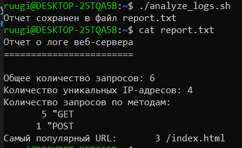

# Итоговое задание № 4
## По теме: "Введение в Linux | Bush | cURL"

## Оглавление:
[1. Описание задания](#описание)

[2. Скриншот](#скриншот)

## Описание

Представляем себе ситуацию, что мы находимся внутри сервера и нам необходимо провести анализ логов, которые там есть. Но, ничего кроме **Bash** и **Linux** там нету, а сделать нужно быстро и эффективно. Поэтому необходимо решить задачу, используя только эти инструменты.

Ваша задача написать к этому файлу с логами несколько команд и упаковать их в .sh скрипт, а именно - 

- Подсчитать общее количество запросов.

- Подсчитать количество уникальных IP-адресов. **Строго с использованием awk**.

- Подсчитать количество запросов по методам (GET, POST и т.д.). **Строго с использованием awk**.

- Найти самый популярный URL. **Строго с использованием awk**.

- Создать отчет в виде текстового файла. Название текстового файла - **report.txt**

В репозитории должны находиться :

1. Файл **analyze_logs.sh** с кодом на языке bash.

2. Файл, который получился при выполнении **analyze_logs.sh**

3. Cкриншот, как сверху, где отчетливо видно, что скрипт запускается, скрипт сделался исполняемым и команда **cat** к файлу **report.txt** работает.
## Решение

## Скриншот
